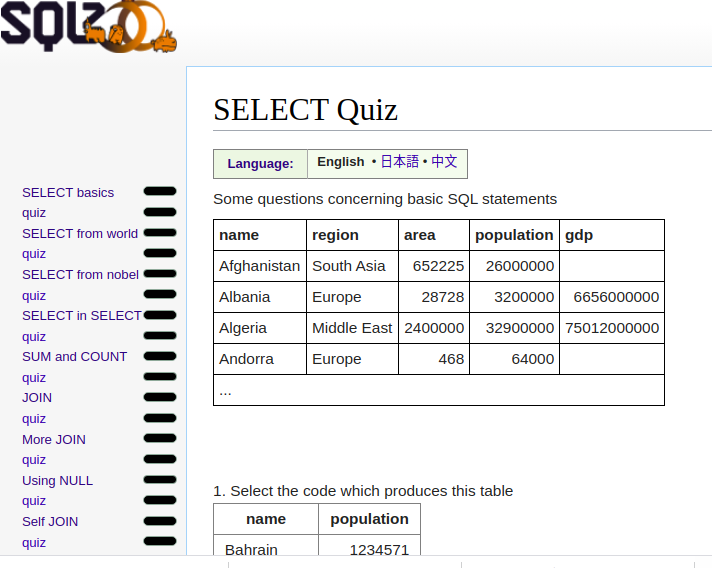

# MySQL-Zoo

### SQL-Zoo
This project Consist of writing different sql queries by responding to quiz access from the SQL-zoo site



<p align="center"> 


</p>

## About the Project
This Project contains different types of SQL Questions and Solutions to the questions. Each folder contains different types of SQL queries from basic to advance. Questions file is a text file contains questions that are got from the SQL zoo website if you don't understand the questions please follow [this link](https://sqlzoo.net/) and find the question from there for better understanding. 
The project follows [sqlzoo tutorials](https://sqlzoo.net/) to get the questions and test the answer from the [sqlzoo](https://sqlzoo.net/) website.

## About the SQL Zoo
SQL Zoo is one of the few resources online that actually lets you build and run queries against existing tables. Each tutorial will show you a table and then have you run queries against it to answer specific questions. Some of the queries, particularly at first, are quite simple. They definitely get more challenging towards the end and can be real head-scratchers.


## Built With

- Sql 


## Getting Started

To get a local copy up and running follow these simple steps.

- clone This repository by using the following command on your local PC:

```
git clone https://github.com/Div685/MySQL-Zoo.git
```
- After cloning navigate to the folder.
- Check Question file in every folder and `*.sql` file for the answer in every folder.

## Author

👤 **Divyesh Patel**

- GitHub: [@FrederickMih](https://github.com/FrederickMih)
- Twitter: [@MihFrederick](https://twitter.com/MihFrederick)
- LinkedIn: [fred-mih](https://www.linkedin.com/in/fred-mih-495bb31a2/)

## 🤝 Contributing

Contributions, issues, and feature requests are welcome!

## License

This project is [MIT](https://github.com/Div685/MySQL-Zoo/blob/development/LICENSE) licensed.

## Show your support

Give a ⭐️ if you like this project!

## Acknowledgements
- [Sqlzoo](https://sqlzoo.net/)